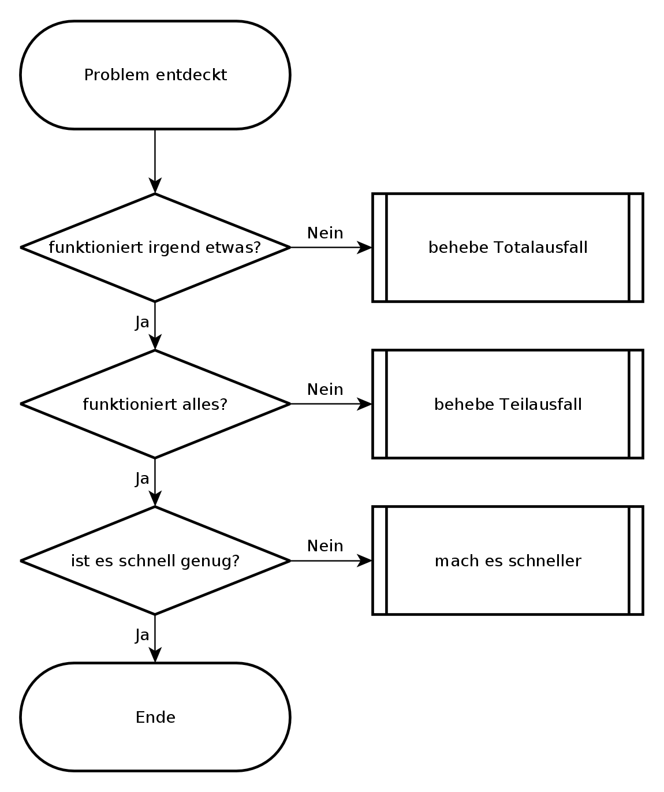

## Entscheidungsbaum {#sec-methoden-entscheidungsbaum}

Wenn ich auf ein neues Problem treffe, versuche ich es so schnell wie
möglich zu charakterisieren, um die nächsten Schritte zu seiner Behebung
herauszufinden.
Dabei helfen mir Entscheidungsbäume.
Programmierer kennen so etwas als Programmablaufplan.

Mein grundlegender Entscheidungsbaum bei der Fehlersuche sieht immer so aus,
wie im folgenden Bild.
Grundsätzlich werde ich nur tätig, wenn eine der Fragen mit nein beantwortet
wird.
Damit habe ich fast alle Probleme abgedeckt, lediglich intermittierende
Probleme erfasst der Entscheidungsbaum nicht.

Die erste Frage geht danach, ob überhaupt noch etwas funktioniert oder ob
es sich um einen Totalausfall handelt.
Diese Frage erscheint vielleicht trivial, aber das ist letztendlich der
Zweck eines Entscheidungsbaumes: das die richtigen Fragen im richtigen Moment
gestellt werden.
Manchmal berichtet ein Anwender, dass eine Funktion eines Programmes nicht
funktioniert und irgendwann stellt sich heraus, dass der ganze Rechner
eingefroren ist und zwar noch den letzten Bildschirm zeigt, aber weder auf
Tastatur, Maus noch Netzwerkzugriffe reagiert.
Ein anderes Mal kommt die Meldung, dass das Internet nicht geht (Totalausfall)
und auf die Bitte, ein oder zwei andere Websites zu besuchen,
stellt sich heraus, dass nur die Startseite des Browsers betroffen ist.
Darum versuche ich mit den ersten Fragen herauszufinden, ob es sich um einen
Totalausfall handelt, den ich anders behandeln muß als einen Teilausfall.

Liegt kein Totalausfall vor, frage ich als nächstes, ob
alle für das Problem relevanten Dienste funktionieren.
Es erfordert schon einige Detailkenntnisse zur Problemzone, um zu entscheiden,
ob ein Dienst für das Problem relevant ist oder nicht.
Im Zweifelsfall kontrolliere ich lieber einen Dienst mehr.
Hier geht es vor allem darum, einen Überblick zu bekommen, was funktioniert und
was nicht und sich dann über Abhängigkeiten der Teilsysteme an den oder die
Urheber des Problems heranzutasten.
Dabei gilt es immer im Hinterkopf zu behalten, dass es zwar meist einen
konkreten Auslöser für ein Problem gibt, aber oft mehrere Ursachen.
Eine Möglichkeit, diese Frage zu beantworten, ist, verschiedene Funktionen einer
Software auszuprobieren, verschiedene Netzdienste und Netzziele zu testen.
Hierbei kann ein Monitoringsystem wie Nagios gute Dienste leisten, wenn es
entsprechend aufgesetzt ist.

Funktionieren alle notwendigen Dienste prinzipiell,
kann ich die nächste Frage stellen: ob es schnell genug ist.
Diese Frage ist nicht leicht zu beantworten, da jeder seine eigene
Vorstellung von schnell genug hat.
Gibt es SLA, können diese vielleicht bei der Beantwortung der Frage helfen.
Bei nicht interaktiven Aufgaben, wie Datensicherungen oder Batchjobs kann ich
die Gesamtlaufzeit betrachten und an Hand dieser entscheiden, ob es schnell
genug ist, oder nicht.
Bei Dateiübertragungen kann ich an Hand von Datenübertragungsrate, Netzauslastung und
Übertragungsdauer überschlagen, ob es Performanceprobleme gibt oder nicht.
Bei interaktiven Programmen oder Netzwerkdiensten zählt meist nur die
Antwortzeit des Systems, die im Bereich von Sekundenbruchteilen liegen sollte.
Komme ich zu dem Schluss, dass es sich um ein Performanceproblem handelt,
gehe ich dieses an.
Anderenfalls begründe ich, warum es sich meiner Meinung nach um kein
Performanceproblem handelt.
Dabei kann mir eine Baseline helfen.

Alles in allem habe ich mit den drei Fragen dieses Entscheidungsbaumes eine
Richtschnur, die mir hilft, ein Problem herunterzubrechen und mich dem
wichtigsten Bereich zu widmen, bevor ich mich in den Details verliere.

Dabei muss ich den Entscheidungsbaum nicht zwangsläufig von oben nach unten
verwenden.
Wenn mir ein Netzwerk-Performanceproblem gemeldet wird, überzeuge ich mich
zunächst davon, dass alle für das Problem relevanten Dienste auch funktionieren.
Ich gehe in diesem Fall von unten - dem gemeldeten Performanceproblem -
einen Schritt nach oben um sicher zu sein, dass meine folgenden Überlegungen
auf einer gesicherten Basis stehen. Zum Beispiel kann ein ausgefallener
DNS-Server durch Redundanz zwar kompensiert werden, aber trotzdem zu
Verzögerungen durch Timeouts führen, die dann als Performanceproblem
wahrgenommen werden.

Außer den drei Hauptfragen gibt es eine vierte Frage, die ich ständig
im Hinterkopf behalten muss.
Das ist die Frage nach intermittierenden Fehlern und nach der
Reproduzierbarkeit des Problems, beziehungsweise meiner Beobachtungen.
Habe ich es mit intermittierenden Fehlern zu tun, kann ich nicht mit
Sicherheit sagen, ob das Problem wirklich gelöst ist.
Nicht einmal, ob meine bisherigen Überlegungen überhaupt zutreffen.
Stattdessen hatte ich es vielleicht gerade mit einer komplikationsfreien
Zeit zu tun und kurz danach kommt das Problem wieder.
Bei intermittierenden Problemen bleibt mir nur, Daten zu sammeln und über
Korrelation eine Idee zu bekommen, was das Problem auslösen könnte.
Jede Idee, die mir dazu einfällt, muss ich dahingehend prüfen, ob sie
das Problem stabil vorhersagbar macht oder nicht.

