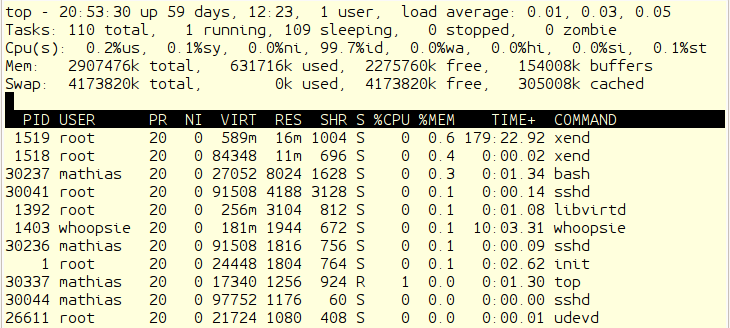

## Engpass RAM

Wenn ich mit den Programmen `free`, `vmstat` oder interaktiv mit `top`
herausbekommen habe, dass der Hauptspeicher momentan der Flaschenhals des
Systems ist, will ich nun herausfinden, was konkret den gesamten Hauptspeicher
aufbraucht und was ich dagegen unternehmen kann.

Um ein Programm in einem Prozess abzuarbeiten, kopiert der Kernel es zuvor
aus dem Dateisystem in den RAM.
Dabei kopiert er nur die Speicherseiten, die als nächstes abgearbeitet werden
sollen und nicht das komplette Programm.
Das gleiche Programm, wenn es in verschiedenen Prozessen abläuft,
wird nur einmal kopiert, lediglich den Stack und
den Heap hat jeder Prozess für sich allein.
Ein Programm, wie `busybox`, dass viele andere Programme ersetzen kann,
spart Speicherplatz im RAM und im Dateisystem.

Für Overlay-Dateisysteme, *tmpfs* oder *loopback*-Mounts benötige ich
weiteren RAM.
Dieser Speicher steht den Prozessen nicht als Arbeitsspeicher zur
Verfügung.

Schließlich verwendet der Kernel den Speicher, der noch nicht für oben
genannte Zwecke verwendet wurde, als Pufferspeicher für Dateizugriffe.
Darum muss ich mich nicht kümmern, da der Kernel diesen
Speicher automatisch freigibt und für andere Zwecke verwendet.

Der Hauptspeicher der X86-Rechnerarchitektur wird in drei Bereiche
unterteilt:

ZONE\_DMA
: von 0 bis 16 MiB. Dieser Bereich enthält Speicherseiten, die Geräte für
  DMA nutzen können.

ZONE\_NORMAL
: von 16 MiB bis 896 MiB. Dieser Bereich enthält normale regulär
  eingeblendete Speicherseiten.

ZONE\_HIGHMEM
: ab 896 MiB. Dieser Bereich enthält Speicherseiten, die nicht
  dauerhaft in den Adressbereich der 32-Bit-CPU eingeblendet sind.

### Analyse der Speichernutzung

Um die Speichernutzung eines Linux-Systems zu analysieren, greife ich
auf die Programme `free`, `top`, `ps` und `pmap` zurück.

Das Programm `free` zeigt mir einen Überblick zur momentanen Belegung
des gesamten nutzbaren Systemspeichers:

{line-numbers=off,lang="bash"}
    $ free
                 total   used   free shared buffers cached
    Mem:        255488 135984 119504      0    6588 108732
    -/+ buffers/cache:  20664 234824
    Swap:            0      0      0

Dabei sehe ich unter *total* nie den gesamten Speicher, weil der vom
Kernel selbst und der von der Hardware verwendete Teil heraus gerechnet wird.

Der Speicher unter *buffers* enthält temporäre Daten der laufenden
Prozesse, also Eingangsqueues, Dateipuffer und Ausgabequeues.
Der als *cached* markierte Speicher enthält zwischengespeicherte
Dateizugriffe.

Mit dem Programm `top` kann ich einzelne Prozesse, die besonders viel
Speicher verbrauchen, näher eingrenzen.
Es liefert in den Kopfzeilen eine Übersicht über die Prozesse, die CPU-Last
und den Gesamtspeicherverbrauch und darunter eine Tabelle mit den Daten
einzelner Prozesse.
Die Ausgabe wird laufend aktualisiert und lässt sich anpassen.
Mit `?` erhalte ich eine Hilfeseite über die möglichen Modifikationen.
Mich interessiert in diesem Fall die Sortierung nach Speicherverbrauch,
die ich durch Eingabe von `m` bekomme.

Für die Speicheranalyse interessieren mich vor allem vier Spalten:

VIRT
: steht für die virtuelle Größe des Prozesses.
  Diese setzt sich zusammen aus dem eingeblendeten Speicher, in den
  Adressbereich eingeblendeten Dateien und Speicher, den der Prozess
  mit anderen teilt.
  Mit anderen Worten, der Speicher auf den ein Prozess gerade Zugriff hat.
  Darin ist auch der ausgelagerte Speicher enthalten.

RES
: steht für *resident size*, den physischen Speicher, den der Prozess belegt.
  Dieser geht in die Berechnung der *%MEM* Spalte ein.

SHR
: ist der Anteil von *VIRT*, den der Prozess mit anderen teilen kann.

%MEM
: ist der prozentuale Anteil eines Prozesses am verfügbaren physischen Speicher.

Mit dem Programm *ps* bekomme ich einen Schnappschuss des momentanen
Speicherverbrauchs aller Prozesse:

{line-numbers=off,lang="bash"}
    $ ps aux
    USER     PID %CPU %MEM  VSZ   RSS ...COMMAND
    root       1  0.0  0.2 2024   676 ...init [2]  
    ...
    mathias 9042  0.0  0.3 2344   904 ...ps aux

Um die Prozesse mit dem größten Speicherverbrauch zu finden,
sortiere ich nach Spalte 6, RSS:

{line-numbers=off,lang="bash"}
    $ ps aux|sort -n -k6 -r |head
    mathias 9006  0.1  1.9 6220  4928 ...-bash
    snmp    1031  0.1  1.6 8832  4268 .../usr/sbin/snmpd
    ntp      954  0.0  0.7 4576  1920 .../usr/sbin/ntpd 
    root    9005  0.0  0.4 2396  1048 .../usr/sbin/dropb
    root     898  0.0  0.3 3808   928 .../usr/sbin/cron
    mathias 9054  0.0  0.3 2344   908 ...ps aux
    root    2260  0.0  0.3 2960   900 .../usr/sbin/pppd 
    dnsmasq  842  0.0  0.3 4116   840 .../usr/sbin/dnsma
    mathias 9057  0.0  0.3 2036   768 ...less -S
    root     220  0.0  0.2 2252   720 ...udevd --daemon

Für die Speicheranalyse interessieren mich die Spalten *VSZ* (virtual set
size), *RSS* (resident set size) und *PID* (process id). Die PID,
um damit den Prozess mit *pmap* zu untersuchen:

{line-numbers=off,lang="bash"}
    $ sudo pmap -d 1031
    1031:   /usr/sbin/snmpd -Lsd -Lf /dev/null -u snmp...
    Address   Kbytes Mode  Offset...Mapping
    08048000      24 r-x-- 000000...snmpd
    0804e000       4 rw--- 000000...snmpd
    09cd4000    1156 rw--- 000000...  [ anon ]
    b70bf000      40 r-x-- 000000...libnss_files-2.11.2.so
    b70c9000       4 r---- 000000...libnss_files-2.11.2.so
    b70ca000       4 rw--- 000000...libnss_files-2.11.2.so
    ...
    b77c7000       4 r-x-- 000000...  [ anon ]
    b77c8000     108 r-x-- 000000...ld-2.11.2.so
    b77e3000       4 r---- 000000...ld-2.11.2.so
    b77e4000       4 rw--- 000000...ld-2.11.2.so
    bfc54000     332 rw--- 000000...  [ stack ]
    mapped: 8828K    writeable/private: 2172K  shared: 0K

Der in der letzten Zeile als *writeable/private* bezeichnete Speicher
ist der, den der Prozess nur für sich verbraucht und nicht mit anderen
teilt.

### Swappiness

Falls, trotz aller Bemühungen, der Speicher im System knapp wird,
kann ich ab Kernel 2.6 zumindest darauf Einfluss nehmen, ob der Kernel eher
Prozesse und Daten auslagert (*swapping*),
oder eher die Caches verkleinert, wenn der Speicher zur Neige geht.
Das geht mit dem Parameter *Swappiness*, der als Zahl von 0 .. 100
eingestellt wird. Dabei bedeutet 100, das der Kernel eher auslagert und
0, dass der Cache sehr klein werden kann. Die Standardeinstellung ist
60, für Laptops wird ein Wert kleiner oder gleich 20 empfohlen. Diesen
Parameter kann ich zur Laufzeit ändern:

{line-numbers=off,lang="bash"}
    # sysctl -w vm.swappiness = 30

oder:

{line-numbers=off,lang="bash"}
    # echo 30 > /proc/sys/vm/swappiness

Falls mein System ohne Auslagerungsspeicher läuft, ist das jedoch
irrelevant.

