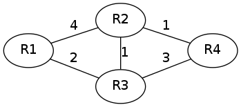

## Routing-Algorithmen

Heute eingesetzte Routing-Protokolle basieren meist auf einem von zwei
Algorithmen: dem *Distanzvektor-Algorithmus* oder dem *Link-State-Algorithmus*.

Beide sind verteilte Algorithmen, bei denen jeder Router für sich selbst die
optimale Route zu einem Netzbereich ermittelt.
Demgegenüber steht der Ansatz von OpenFlow bei Routern und Switches der
erlaubt, die Routen zentral zu berechnen und dann an die verschiedenen Router
und/oder Switches zu verteilen.
Dieser Ansatz erlaubt experimentelle Routing-Algorithmen auszuprobieren,
ohne dass man an der Hardware oder Routersoftware etwas ändern muss.

Bei den verteilten Algorithmen muss man einen Kompromiss finden
zwischen dem nötigen Netzverkehr für das Routingprotokoll und der
Rechenleistung für die Berechnung der Routen.
Bei Routingprotokollen mit Distanzvektor-Algorithmus steigt der Datenverkehr
für das Routingprotokoll sehr stark mit der Vergrößerung des Netzwerks, bei
den Routingprotokollen mit Link-State-Algorithmus steigt der Rechenaufwand
stärker.

Für die Betrachtung der beiden Algorithmen verwende ich diese beispielhafte
Routerkonstellation.

Die Knoten des Graphen stehen für die beteiligten Router, die Zahlen an den
Kanten geben die Metrik für die Verbindung zwischen den beiden verbundenen
Routern wieder.

### Distanzvektor-Algorithmus

Dieser Algorithmus zur Bestimmung der optimalen Route wird bei
den Protokollen RIP und RIP2 verwendet.

Dabei informiert jeder Router alle direkten Nachbarn über alle ihm selbst
bekannten Routen nebst deren Metriken.
Jeder Router, der Informationen von seinen Nachbarn erhält, fügt neu
bekannt gewordene Routen zu seiner eigenen Routingtabelle hinzu und behält bei
bereits bekannten Routen diejenige mit der kleinsten Metrik.

Distanzvektor-Protokolle werden auch als Routing nach Gerücht bezeichnet.
Fehlerhafte Routinginformationen verbreiten sich hier genau so schnell wie gute.

Für die weitere Betrachtung nehme ich an, dass immer zuerst Router R1 seine
Routen bekannt gibt, dann R2, R3 und schließlich R4.

Am Anfang kennt jeder Router nur seine nächsten Nachbarn.

| Router | Ziel | Weg    | Metrik |
|--------|------|--------|--------|
| R1     | R2   | direkt | 4      |
| R1     | R3   | direkt | 2      |
| R2     | R1   | direkt | 4      |
| R2     | R3   | direkt | 1      |
| R2     | R4   | direkt | 1      |
| R3     | R1   | direkt | 2      |
| R3     | R2   | direkt | 1      |
| R3     | R4   | direkt | 3      |
| R4     | R2   | direkt | 1      |
| R4     | R3   | direkt | 3      |

Wenn R1 seine Routen bekanntgibt ändert sich daran noch nichts.

Sendet R2 seine Routen, ändert sich dadurch folgendes:

| Router | Ziel | Weg    | Metrik |
|--------|------|--------|--------|
| R1     | R4   | R2     | 5      |
| R3     | R4   | R2     | 2      |
| R4     | R1   | R2     | 5      |

Nachdem R3 seine Routen gesendet hat ändern sich die folgenden Einträge:

| Router | Ziel | Weg    | Metrik |
|--------|------|--------|--------|
| R1     | R2   | R3     | 3      |
| R1     | R4   | R3     | 4      |
| R2     | R1   | R3     | 3      |

Wenn schließlich R4 seine Routen bekannt gibt, ändert sich nichts an den
Routingeinträgen. Das gleiche trifft für den nächsten Update von R1 zu.

Wenn R2 das nächste Mal seine Routen bekannt gibt, ändert sich zwar keine
Route aber eine Metrik

| Router | Ziel | Weg    | Metrik |
|--------|------|--------|--------|
| R4     | R1   | R2     | 4      |

Danach sind die Routen und Metriken stabil, bis eine Änderung auftritt.

Am Router R1 sieht die Routingtabelle im stabilen Zustand wie folgt aus:

| Router | Ziel | Weg    | Metrik |
|--------|------|--------|--------|
| R1     | R2   | R3     | 3      |
| R1     | R3   | direkt | 2      |
| R1     | R4   | R3     | 4      |

An diesem relativ einfachen Beispiel ist zu sehen, dass dieser Algorithmus
manchmal mehrere Zyklen braucht, bis die Routingeinträge zu einem stabilen
Zustand finden.

X> Ausgehend vom stabilen Zustand, entferne eine beliebige Route und spiele die
X> Routingänderungen durch bis zum Erreichen eines neuen stabilen Zustands.

### Link-State-Algorithmus

Das Protokoll OSPF verwendet den Link-State-Algorithmus.

Dieser Algorithmus arbeitet in zwei Schritten: zunächst erstellt jeder Router
anhand der Zustandsinformationen der Verbindungen seiner Nachbarn eine
topologische Karte (einen Graphen) des gesamten Netzwerks, bei der die Knoten
die Router darstellen und die Kanten die gewichteten Verbindungen zwischen
diesen.
Im zweiten Schritt errechnet der Routing-Prozess mit Hilfe des
Dijkstra-Algorithmus den optimalen Pfad zu allen bekannten Netzen.

#### Dijkstra-Algorithmus

0.  Der Routing-Prozess trägt alle Knoten in eine Tabelle *Q* ein und weist
    ihnen die Distanz unendlich zu und einen unbekannten Vorgänger.
    Dem Startknoten, also dem Router, auf dem der Prozess läuft weist er dann
    die Entfernung 0 zu.

1.  Solange es noch Einträge in der Tabelle *Q* gibt, wählt der
    Routing-Prozess den Eintrag mit der geringsten Distanz aus.

    a.  Der ausgewählte Knoten wird aus der Tabelle *Q* entfernt und inTabelle
	*R* eingetragen.
	Für diesen Knoten ist die kürzeste Distanz bereits bestimmt.

    b.  Für alle direkten Nachbarn des ausgewählten Knoten wird die Distanz
	bestimmt. Ist die Distanz geringer als in der Tabelle *Q*, wird die
	Distanz in der Tabelle *Q* durch die neu bestimmte ersetzt und der
	ausgewählte Knoten als Vorgänger eingetragen.

	Die Distanz wird dabei bestimmt aus der Summe der Distanz des eben
	entfernten Knotens und dem Kantengewicht zwischen diesem und dem
	betrachteten Knoten.

Wenn wir den Dijkstra-Algorithmus am Router R1 für oben angeführten
Router-Graph durchspielen wollen, initialisieren wir die Tabelle *Q* wie
folgt:

| Knoten | Vorgänger | Distanz   |
|--------|-----------|-----------|
| R1     | unbekannt | 0         |
| R2     | unbekannt | unendlich |
| R3     | unbekannt | unendlich |
| R4     | unbekannt | unendlich |

Wir entfernen R1 aus Tabelle *Q*, bestimmen die Distanz für alle noch in *Q*
enthaltenen direkten Nachbarn von R1.

| Knoten | Vorgänger | Distanz   |
|--------|-----------|-----------|
| R2     | R1        | 4         |
| R3     | R1        | 2         |
| R4     | unbekannt | unendlich |

Wir entfernen R3 und bestimmen wieder die Distanz für die verbleibenden
Nachbarn.

| Knoten | Vorgänger | Distanz   |
|--------|-----------|-----------|
| R2     | R3        | 3         |
| R4     | R3        | 5         |

Nun entfernen wir R2 und bestimmen die Distanz für R4 neu.

| Knoten | Vorgänger | Distanz   |
|--------|-----------|-----------|
| R4     | R2        | 4         |

Dann entfernen wir den letzten Knoten, R4 und haben nun folgende Pfad-Tabelle
*R* am Router R1:

| Knoten | Vorgänger | Distanz   |
|--------|-----------|-----------|
| R1     | unbekannt | 0         |
| R2     | R3        | 3         |
| R3     | R1        | 2         |
| R4     | R2        | 4         |

Diese Tabelle enthält die Pfade zu allen Zielen im Netz. Damit daraus eine für
den Kernel brauchbare Routing-Tabelle wird, müssen wir die Pfade noch auf den
jeweiligen Next-Hop abbilden:

| Ziel | Next-Hop | Distanz |
|------|----------|---------|
| R1   | selbst   | 0       |
| R2   | R3       | 3       |
| R3   | direkt   | 2       |
| R4   | R3       | 4       |

Es ist leicht zu sehen, dass bei diesem Algorithmus relativ wenige
Informationen über das Netz gesendet werden müssen. Dafür ist der
Rechenaufwand bei jedem einzelnen Knoten höher als beim
Distanzvektor-Algorithmus.

Dafür konvergiert dieser Algorithmus schneller, da sämtliche Routen sofort
berechnet werden können, sobald der vollständige Graph bekannt ist.

X> Bestimme die Routing-Tabelle für die anderen Router mit dem
X> Dijkstra-Algorithmus.

