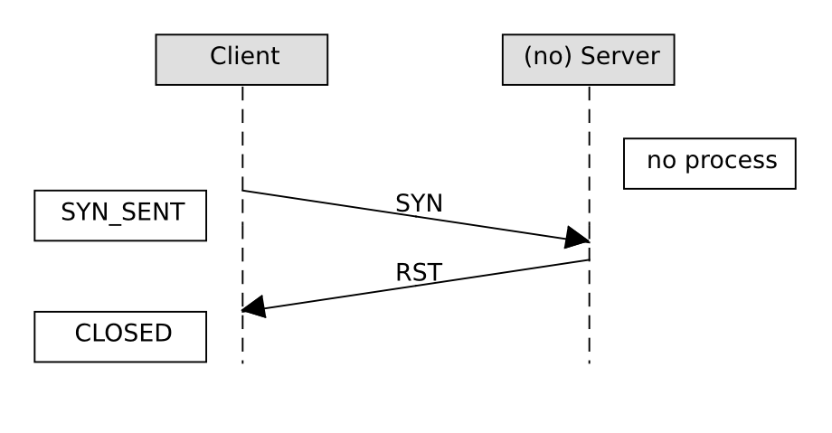
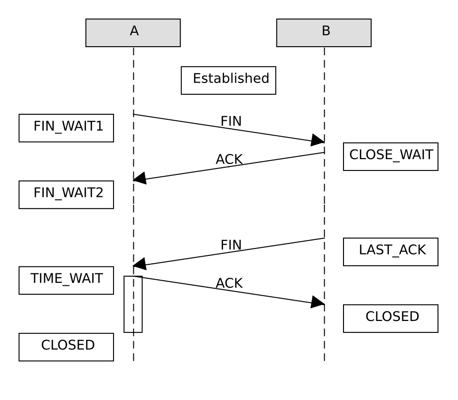

## Zustände einer TCP-Verbindung {#sec-tcp-grundlagen}

Ich betrachte hier die Zustände einer TCP-Verbindung, weil TCP vermutlich das
am häufigsten im Netz vorkommende Protokoll ist.
Außerdem ist es komplex genug, um sich wenigstens mit den grundlegenden
Interna zu beschäftigen damit ich das Verhalten der Beteiligten im Störungsfall
einschätzen kann.

### Verbindungsaufbau

Beim Aufbau einer TCP-Verbindung haben wir immer eine passive Seite
- üblicherweise der Server, bei FTP auch manchmal der Client - und eine aktive
Seite.
Die passive Seite beginnt im Zustand LISTEN.

A> Um den Zustand der TCP-Verbindungen auf einem Rechner anzusehen nutze ich
A> den Befehl
A>
{line-numbers=off,lang="text"}
A>     $ netstat -ant

Ein erfolgreicher Verbindungsaufbau benötigt drei Datenpakete und geht wie
folgt vonstatten:

Der Client sendet ein SYN-Paket (das ist ein TCP-Datagramm mit gesetztem
SYN-Flag) und geht in den Zustand *SYN_SENT*.
Sobald das SYN-Paket beim Server ankommt, bestätigt dieser es mit einem
SYN-ACK-Paket und geht in den Zustand *SYN_RCVD*.
Der Client bestätigt das SYN-ACK-Paket mit ACK und geht in den Zustand
*ESTABLISHED*.
Sobald das ACK-Paket beim Server ankommt geht dieser ebenfalls in den Zustand
*ESTABLISHED* und die Verbindung ist vollständig etabliert.

Nur bei den ersten beiden Datenpaketen kann ich vom Netzwerk aus sehen, welche
Seite die Verbindung aktiv aufgebaut hat.

Wenn an dem betreffenden Port auf Serverseite kein Prozess lauscht oder der
Server eine Verbindung abweist, sieht das wie folgt aus:

Der Client sendet wie eben ein SYN-Paket.
Von Serverseite aus folgt unmittelbar ein RST-Paket und schon ist es vorbei.
Alternativ kann der Server auch ein ICMP-Paket vom Typ 3 (*Destination
unreachable*) mit Code 3 (*Port unreachable*) senden, das ist jedoch eher für
das Protokoll UDP üblich.

Ist stattdessen der Serverport durch Paketfilter-Regeln gesperrt, kommt vom
Server gar nichts und der Client wiederholt sein SYN-Paket noch einige Male,
bevor er aufgibt.

### Verbindungsabbau

Während für den TCP-Verbindungsaufbau drei Datenpakete reichen, benötigt TCP
für den Abbau einer Verbindung vier Datenpakete.
Da sowohl Client als auch Server die Verbindung zuerst schließen können, nenne
ich die beteiligten Parteien hier A und B:

A schließt auf seiner Seite einseitig die TCP-Verbindung indem er ein
FIN-Paket sendet, anschließend geht er in den Zustand *FIN_WAIT1*.
B bestätigt das FIN-Paket normal mit ACK und geht in den Zustand *CLOSE_WAIT*.
Jetzt könnte B noch Daten über die halbgeschlossene Verbindung senden, A
sendet keine Daten mehr, nur noch ACK.
Irgendwann sendet B ebenfalls ein FIN-Paket und geht in den Zustand *LAST_ACK*
über.
Sobald A das FIN-Paket empfängt, bestätigt es dieses mit ACK und geht für die
doppelte MSL in den Zustand *TIME_WAIT* und danach in den
Zustand *CLOSED*.
B geht mit Empfang der Bestätigung von A sofort in den Zustand *CLOSED*.

Da A noch eine Zeit lang im Zustand *TIME_WAIT* verbleibt, kann ich solange
mit `netstat -ant` sehen, dass dieser die Verbindung
zuerst geschlossen hat.

### Flusssteuerung

In [[ctZivadinovic2012](#bib-ct-zivadinovic2012)] erläutert der Autor die
Funktionsweise der TCP-Flusskontrolle ausführlich und sehr anschaulich.

Es gibt zwei Aspekte bei der TCP-Flusssteuerung.
Zum einen teilt der Empfänger dem Sender mit, wie viele Bytes er momentan
verarbeiten kann.
Zum anderen will der Sender die Datenrate so steuern, dass die Daten so
schnell wie möglich, aber mit möglichst geringen Verlusten durch Überlastung
der Leitung übertragen werden.

Für das erste Problem gibt es im TCP-Header das Feld RWIN (*Receive Window*).
In dieses trägt der Empfänger den momentan freien Platz im Empfangspuffer ein.
Ein *Receive Window* von 0 bringt die Datenübertragung zum Erliegen und deutet
darauf hin, dass der Empfänger die Daten nicht schnell genug verarbeiten kann.
Das kann ein Hinweis sein, bei Performanceproblemen die Situation auf dem
empfangenden Rechner in Augenschein zu nehmen.

Neben der Anzahl der beim Empfänger eintreffenden Datenpakete begrenzt das
*Receive Window* auch die maximal erreichbare Datenübertragungsrate, abhängig von der RTT
zwischen Sender und Empfänger.
Die RTT beträgt im LAN typischerweise weniger als eine Millisekunde, innerhalb
Deutschlands etwa fünfzig Millisekunden und interkontinental mehr als hundert
Millisekunden.
Der Sender sendet maximal soviel Daten, wie im *Receive Window* vorgegeben,
ohne Bestätigung durch ACK-Pakete an den Empfänger.

Die folgende Tabelle soll den Einfluß der RTT auf die erzielbare Datenrate
verdeutlichen.
Bei einer Erhöhung der RTT um das zehnfache sinkt die Datenrate um den Fakter
zehn, wenn das *Receive Window* gleich bleibt.

{width="wide"}
|  RWIN | RTT (ms) | Datenrate (MB/s) |
|-------|----------|------------------|
| 50000 |        1 |             ~ 50 |
| 50000 |       10 |              ~ 5 |
| 50000 |      100 |            ~ 0,5 |

Darum ist es bei Breitbandverbindungen mit hoher RTT hilfreich, das
*Receive Window* des Empfängers zu erhöhen, wenn die maximal mögliche
Datenübertragungsrate nicht erreicht wird.

Da TCP bereits 1981 entwickelt wurde, ist das Parameterfeld für das *Receive
Window* nur 16 Bit groß, der Maximalwert liegt also bei 65535.
Aus diesem Grund gibt es in modernen TCP-Stacks die Möglichkeit des *Windows
Scaling*.
Dabei wird beim Verbindungsaufbau ein Multiplikator für das RWIN-Feld
ausgehandelt, der für beide Seiten verbindlich ist.
Dieser Multiplikator ist eine Potenz von zwei und kann von {$$}2^{0}{/$$} bis
{$$}2^{14}{/$$} reichen,
beim Aushandeln der Verbindung wird nur der Exponent übertragen.

Für die Flusssteuerung zur Vermeidung von Überlast gibt es verschiedene
Algorithmen, die zum Teil gemeinsam verwendet werden können.
Der Sender führt für die Verbindung ein Congestion Window, das ihm anzeigt,
wieviel Bytes er momentan auf die Leitung schicken könnte.

#### Slow Start und Congestion Avoidance

Bei diesem Verfahren startet die Datenübertragung mit einem Congestion Window
von einer Maximum Segment Size (MSS) und erhöht diese mit jedem empfangenen
ACK um eine MSS.
Das führt zu einem exponentialen Wachstum des Congestion Windows.

Bei Erreichen der *Slow Start Threshold* wird das Congestion Windows nur noch
um eine MSS erhöht, wenn alle Datenpakete aus dem aktuellen Fenster bestätigt
wurden. Das führt zu einem linearen Wachstum des Congestion Window.

Wird durch Timeout der Verlust eines Datenpakets festgestellt, beginnt dass
Congestion Window wieder bei einer MSS.

#### Fast Retransmit und Fast Recovery

Hierbei informiert der Empfänger den Sender über mögliche Paketverluste sobald
er Datenpakete außer der Reihe empfängt.
Dazu bestätigt er das letzte Datenpaket in der richtigen Reihenfolge mit jedem
neu ankommenden Datenpaket außer der Reihe durch DUP-ACK (Duplicate
Acknowledgements).
Der Sender sendet das verlorene Datenpaket sofort nach dem dritten DUP-ACK und
wartet nicht auf den Timeout.
Das Congestion Window wird in diesem Fall nur halbiert und nicht wie bei Slow
Start auf ein MSS reduziert.

#### Selective Acknowledgements (SACK)

Zusätzlich zum letzten regulären Paket bestätigt der Empfänger in den DUP-ACK
die außer der Reihe angekommenen Datenpakete in zusätzlichen
TCP-Headerfeldern, so dass diese nicht noch einmal gesendet werden müssen.

