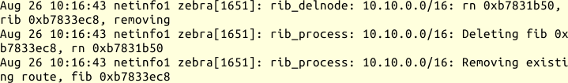
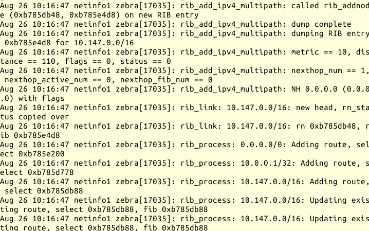

## Routingprobleme

> "Die Kunden beschweren sich über Verbindungsabbrüche, kannst Du bitte mal
> die Leitung prüfen."

So oder so ähnlich höre ich es ab und zu von den Kollegen, ich sehe mir die
Leitung an und kann oft nichts Auffälliges entdecken.

Da wir ein relativ komplexes Netz betreiben, mit mehreren Dutzend Segmenten,
verwenden wir Routingprotokolle, um den Gateways die Routen bekannt zu machen.

Und diese Routingprotokolle, so sehr sie die Arbeit auch erleichtern, bringen
zusätzliche Angriffsflächen in das System, über die sich Fehler einschleichen
können.

Nun kann ich mich auf den Standpunkt stellen: ich eliminiere diese
Fehlerquelle, indem ich nur statische Routen verwende.
Bis zu einer gewissen Anzahl von Netzsegmenten ist das eine vernünftige
Entscheidung.
Irgendwann aber kommt der Punkt, ab dem ich die nötige Sorgfalt beim Eintragen
der statischen Routen nicht mehr aufbringen kann oder will.
Wo diese Grenze ist, muss jeder für sich entscheiden.
Insbesondere, wenn es temporäre Netze gibt, die nach wenigen Tagen
bereits wieder ausgetragen werden müssen, verschiebt sich diese Grenze für
mich sehr schnell nach unten.

A> Es gibt auch die Ansicht, das mit Hilfe von Routingprotokollen das Netz
A> automatisch zu einem neuen stabilen Zustand konvergiert, wenn einzelne Pfade
A> ausfallen, das Netz aber trotzdem genügend redundante Wege hat.
A> In diesem Fall würde ich meine Erwartungen nicht zu hoch schrauben, da
A> es sich um ein verteiltes dezentrales System handelt, dessen Verhalten im
A> Fehlerfall nicht am grünen Tisch vorhergesagt werden kann.

Was kann ich tun, wenn ich auf Grund der Komplexität des Netzes ein oder
mehrere Routingprotokolle einsetze und bei festgestellten Verbindungsabbrüchen
sicher gehen will, dass diese nicht vom Routing verursacht wurden?

An dieser Stelle setze ich einmal mehr auf Monitoring, also lückenlose
Beobachtung der Routen im Netz.
Gerade ein Rechnernetz ist ein Paradebeispiel für ein verteiltes System,
dessen Funktionieren vom Funktionieren seiner Komponenten abhängt.
Ich bin daran interessiert, so früh, wie möglich festzustellen,
wenn eine Komponente nicht mehr funktioniert.

### Wie kann ich Netzwerkrouten überwachen?

Sicher gibt es für dieses Problem kommerzielle Systeme, mit denen ich das
Netzwerk und Routingprobleme darin bequem und einfach diagnostizieren kann.
In diesem Buch geht es aber um freie Software und darum, ein Verständnis für
das untersuchte Problem zu entwickeln.

Ich kann mit der - zumindest von mir - unter Linux am häufigsten eingesetzten
Routingsoftware *Quagga* nicht nur meinen Rechner selbst am Routingprotokoll
teilnehmen lassen, sondern auch über die Debugfunktionen den Zustand der
Protokolle analysieren und über die Protokollfunktion das Routing überwachen.

Will ich  nur mitbekommen, wann welche Route im Netz hinzukam oder
verschwand, wende ich mich direkt an den Dämon `zebra`.
Ich schalte das Logging ein und teile ihm mit, welche Informationen ich haben
will.

{line-numbers=off,lang="text"}
    $ telnet localhost zebra
    zebra> enable
    zebra# conf t
    zebra(config)# log syslog
    zebra(config)# debug zebra rib
    zebra(config)# end
    zebra# write file

Dadurch, das ich `zebra` via Syslog protokollieren lasse, kann ich die
Auswertung auf einem anderen Rechner vornehmen, wenn `syslogd` entsprechend
konfiguriert ist.
Mit `debug zebra rib` habe ich ihm mitgeteilt, dass ich Informationen zur
Routing Information Base haben will.
Daraufhin finde ich Einträge wie diese für entfernte Routen:

Die Einträge für hinzugekommene Routen sehen so aus:

Diese Logzeilen sind schon sehr informativ, für eine schnelle Auswertung auf
einen Blick aber zu unübersichtlich.

Ich nehme daher mein Standardgerüst für Perl-Skripts zur Syslog-Auswertung und
ergänze dieses um die folgenden Zeilen:

    my $wanted = 'zebra';
    my $ip4 = qr|(\d{1,3}(?:\.\d{1,3}){3}/\d{1,2})|;
    my $del = qr|^rib_process: $ip4: Removing existing|;
    my $add = qr|^rib_process: $ip4: Adding route|;

    sub process_line {
        my ($time,$host,$name,$pid,$text) = @_;
        if ($text =~ /$del/) {
            print "$time $host $name: remove $1\n";
        }
        elsif ($text =~ /$add/) {
            print "$time $host $name: add $1\n";
        } 
    }

In Zeile 1 lege ich die gewünschten Logzeilen anhand des Prozessnamens fest.
Zeilen 2 bis 4 definieren reguläre Ausdrücke, die mir die Informationen aus
den Logzeilen beschaffen. Die Netzadresse der Route landet in der temporären
Variable `$1`, die ich in den Zeile 9 für die entfernten und Zeile 12 für die
zugefügten Routen ausgebe.

Damit sieht die Ausgabe dann so aus:

{line-numbers=off,lang="text"}
    Aug 26 10:16:43 netinfo1 zebra: remove 10.10.0.0/16
    Aug 26 10:16:47 netinfo1 zebra: add 0.0.0.0/0
    Aug 26 10:16:47 netinfo1 zebra: add 10.0.0.1/32
    Aug 26 10:16:47 netinfo1 zebra: add 10.147.0.0/16

Alternativ hätte ich die Änderungen auch in eine Datenbank schreiben können,
die ich dann interaktiv abfragen könnte.

Sagt mir mein Routing-Monitor, dass ein festgestellter Verbindungsabbruch mit
einer Routingänderung einhergeht, muss ich mich näher mit den
Routingprotokollen beschäftigen.

Ein sehr guter Einstieg in das Thema ist [[Malhotra2002](#bib-malhotra2002)].
Zum einen, weil er auf die Protokolle detailliert eingeht
und zum anderen, weil ich die für Cisco IOS geschriebenen
Konfigurationsbeispiele mit Quagga sehr gut nachvollziehen kann.

### RIP-2

RIP-2 ist ein sehr einfaches und robustes Protokoll, das seinem
Vorgänger RIP vor allem mit der Fähigkeit zu CIDR überlegen ist.
Es ist in [RFC 2453](#bib-www-ietftools) beschrieben,
[RFC 4822](#bib-www-ietftools) ergänzt es um kryptographische Authentisierung.
RIP und RIP-2 nutzen den Distance-Vektor-Algorithmus zur Berechnung der
Routen.
Außerdem kann es die Next-Hop-Address zu einer Route angeben, wodurch ich mit
RIP-2 einen Übergang zu anderen Routing-Protokollen schaffen kann.
Weiterhin ist es möglich, Authentisierungsdaten zu verwenden, um die Quelle
eines RIP-2-Datagramms zu verifizieren.

Die Authentisierungsdaten schützen meine Router davor, fehlerhafte Routen von
zufällig im Netz eingesteckten fremden Routern zu übernehmen.
Gleichzeitig verhindern sie den Austausch der Routen zwischen meinen Routern,
falls ich die Authentisierungsinformationen falsch eingetragen habe.

Bei Problemen melde ich mich am RIP-Dämon an:

{line-numbers=off,lang="text"}
    $ telnet localhost ripd

Dann kann ich den Zustand des RIP-Protokolls analysieren.
Zum Monitoring kann ich, wie beim `zebra` Dämon, verschiedene Debugbefehle
nutzen.
Insbesondere schaue ich nach, welche Nachbarn der Router kennt, wann er die
letzten Informationen von diesen bekommen hat und welcher Nachbar welche Route
anbietet.

### OSPF

OSPF ist ein hierarchisches Protokoll.
[RFC 2328](#bib-www-ietftools) beschreibt die Version 2 für IPv4 und
[RFC 5340](#bib-www-ietftools) OSPF für IPv6.

Ich teile das Netz in einzelne Areas (Gebiete) auf, die über eine Zentrale
(Area 0) miteinander verbunden sind.
Die Router in den Areas müssen lediglich die Routen innerhalb der Area und die
Grenzrouter zu anderen Areas oder externen Netzen kennen.
Das Protokoll verwendet den Link-State-Algorithmus für die Berechnung der
Routen, das heißt, jeder Router kennt den Zustand aller Interfaces aller
anderen Router seiner Area und berechnet selbst für sich den kürzesten Pfad
für eine gegebene Route.
OSPF konvergiert meist schneller bei Routingänderungen zum neuen Zustand des
Netzes.
Dafür ist die Berechnung der neuen Route CPU-intensiv.

#### Fehlersuche bei OSPF

Um das OSPF-Protokoll - genau genommen seinen Zustand - zu analysieren, melde
ich mich am *ospfd* von *quagga* an und arbeite überwiegend mit den über
`show ip ospf` erreichbaren Befehlen.

Mit `show ip ospf interface` sehe ich, welche Interfaces aktiv sind, am
OSPF-Protokoll teilnehmen und welche Nachbarn sie kennen.

Um mehr über die Nachbarn zu erfahren, verwende ich die über `show ip ospf
neighbor` erreichbaren Befehle.

Da OSPF sehr prozessorlastig ist, muss ich vielleicht nachsehen, ob ein Router
überlastet ist.
Dabei helfen mir die folgenden Faustregeln, um die zu erwartende Last grob
einzuschätzen:

*   ABR (area border router) machen mehr als interne Router
*   DR (designated router) / BDR (backup designated router) machen mehr als
    andere Router
*   Router in Stub Areas und NSSA (not so stubby areas) machen am wenigsten.

Gegebenenfalls setze ich an den entsprechenden Stellen leistungsstärkere
Router ein oder sorge dafür, dass ein schwächerer Router nicht DR/BDR wird.

Mit dem Befehl `show ip ospf` bekomme ich heraus, wie oft der
OSPF-Algorithmus ausgeführt wurde, das heißt, wie oft die Routen neu berechnet
wurden:

{line-numbers=off,lang="text"}
    ospfd> sh ip ospf
     ...
     SPF algorithm last executed 12h37m18s ago
     ...
     Area ID: 0.0.0.0 (Backbone)
       ...
       SPF algorithm executed 4039 times

Wenn die letzte Zahl sehr hoch ist, und vielleicht noch wächst, während ich
angemeldet bin, deutet das auf ein flatterndes Interface hin.

In diesem Fall kann ich mit den über `debug ospf` erreichbaren Befehlen nach
dem betreffenden Router fahnden und dann das Problem dort untersuchen.
Einfacher ist die Ursache manchmal zu finden, wenn ich sowieso alle
Routingänderungen protokolliere und anhand dieser Protokolle auf die Ursache
schließen kann.

Suche ich hingegen nach einer relativ stabilen aber falschen Route, dann kann
ich die Topologiedatenbank mit den über `show ip ospf database` erreichbaren
Befehlen untersuchen.

### Gemischter Einsatz von statischen und dynamischen Routen

Setze ich in einem Netz sowohl statische als auch dynamische Routen ein,
ist besondere Vorsicht geboten.
Zum einen muss ich die Einspeisung der statischen Route in das dynamische
Protokoll sorgfältig prüfen.
Genauso wichtig ist die korrekte und vor allem wiederauffindbare Dokumentation
dieser Besonderheit.

In einem konkreten Fall hatte ich eine statische Route an einem Border Router
in das OSPF eingespeist.
Beim Austausch des Routers am Next-Hop, über den die Route ging, wurde dieser
ebenfalls in die OSPF-Area aufgenommen.
Der ehemalige Border Router speiste weiterhin seine (für ihn korrekte)
statische Route in die OSPF-Area.
Der neu aufgenommene Router erhielt die korrekte Route via RIP-2, das
niedriger priorisiert war und die (für ihn falsche) Route aus dem OSPF vom
alten Border Router.
Im Ergebnis sandte er die Datenpakete in die falsche Richtung und ich
benötigte einige Zeit und Muße, bis ich durch Vergleich der
OSPF-Routing-Databases der Router darauf kam und die statische
Route als Verursacher ausmachte.
