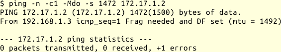

## Sonstige Probleme

### Path-MTU

Ein Problem, das zunächst oft falsch interpretiert wird, tritt auf, wenn die
[automatische Bestimmung der Path-MTU](#sec-path-mtu) nicht funktioniert.
Das kann durch Firewall-Regeln passieren, durch NAT oder durch Probleme beim
Routing.
In Kombination mit einer reduzierten Path-MTU, zum Beispiel bei VPN- oder
PPPoE-Verbindungen (DSL) ergeben sich sehr subtile Fehler.

Ich kann dann Plaintext-Protokolle, wie im vorigen Abschnitt beschrieben,
testen und zum Beispiel einen SMTP-Server als völlig in Ordnung identifizieren.
Trotzdem kann ein anderer SMTP-Server diesem einige E-Mail nicht zustellen,
obwohl mein Test vom selben Rechner aus kein Problem anzeigte.

Beim manuellen Testen des Protokolls entsteht meist kein großes Datenpaket,
das nicht durch alle Netzsegmente unfragmentiert gesendet werden kann.
Das gleiche passiert bei kleinen E-Mails von wenigen hundert Bytes.

Wenn die zu versendende Nachricht jedoch größer ist als die Path-MTU,
sendet der Server mindestens ein zu großes Datagramm.
Da die ICMP-Unreachable-Nachricht nicht bis zu ihm durchdringt, weiß der
Sender nicht, dass das Datagramm nicht ankommt.
Auch das Wiederholen des Datagramms hilft hier nicht.
Der Empfänger hat alle vorherigen Datagramme bestätigt und nun keine
Veranlassung seinerseits etwas zu unternehmen, so dass die Verbindung zum
Stillstand kommt.
Irgendwann beendet einer der Beteiligten die TCP-Sitzung auf Grund
eines Timeouts.

Wenn ich nicht von selbst an dieses mögliche Problem denke, kann ich
sehr lange an den falschen Stellen suchen.

Mit `ping` kann ich testen, ob die Path-MTU geringer ist, als die MTU des
ersten Segments:

Das Beispiel zeigt die Ausgabe, wenn ich versuche über eine PPPoE-Verbindung
ein anderes Netz zu erreichen.
Mein PING-Datagramm ist 1500 Byte groß, es gehen aber nur 1492 Byte über den
nächsten Hop.
Wenn ich es 8 Byte kleiner mache, funktioniert es:

Bei gestörter Path-MTU-Discovery werde ich die Fehlermeldung beim ersten Test
nicht sehen, sondern einfach keine Antwort bekommen.
Dann muss ich dem Datenpfad folgen und sehen, wie weit meine Datagramme
kommen.

Habe ich ein Problem mit der Path-MTU-Discovery festgestellt, ist
die nächste Frage, wie ich das abstelle.

Die schnellste Lösung ist, die MTU des Senders zu reduzieren.
Damit verringere ich die nutzbare Bandbreite, weil auf Grund der kleineren
Datenpakete das Verhältnis von Nutzdaten zu Protokolldaten ungünstiger wird.
Darum ziehe ich das im Allgemeinen nur als temporäre Lösung in Betracht.

Für TCP habe ich auf den Gateways oft die Möglichkeit, die MSS-Option beim
Verbindungsaufbau zu modifizieren, so dass alle TCP-Verbindungen über den
entsprechenden Weg automatisch mit einer geringeren maximalen Größe der
Datagramme arbeiten.
Das Stichwort, wonach ich in der Dokumentation suche, lautet MSS-Clamping.
Das ist insbesondere dadurch vorteilhaft, weil es nur die TCP-Verbindungen
betrifft, die über den problematischen Abschnitt laufen.
Außerdem muss ich nichts an den Endpunkten der Verbindung einstellen.

Die sauberste Lösung ist jedoch, die Ursache für die Störung bei der
Path-MTU-Discovery zu beseitigen.

