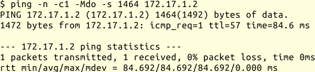

## Sonstige Probleme

### Mehrere Router im Netzsegment

Dieses Problem hat dazu geführt, dass ich in Netzsegmenten mit Endgeräten,
die nicht von mir betreut werden, möglichst vermeide,
mehrere Router zu verschiedenen Netzen einzusetzen.

Üblicherweise kennen Arbeitsstationen und Server, die sich nicht an den
Routingprotokollen beteiligen, nur ein Gateway in andere Netze. Alle
Datagramme, die nicht für das lokale Netzsegment bestimmt sind, werden an
dieses Gateway geschickt und von diesem weitergeleitet.

Oft genug habe ich erlebt, dass mal eben ein weiteres Netz über ein
zusätzliches Gateway in diesem Netzsegment angeschlossen wird.
Abgesehen von möglichen Sicherheitsproblemen schicken die Clients ihre
Datagramme für dieses Netz zum Standardgateway.

Das ist an und für sich kein Beinbruch, da das Standardgateway die Datagramme
an das richtige Gateway weiterleitet und dem Sender eine ICMP-Nachricht
schickt, dass dieser das andere Gateway für dieses Netz verwenden soll.

Dieses Verfahren hat nur einen geringen Overhead und funktioniert in vielen
Fällen problemlos.
Außer, wenn es nicht funktioniert.

Alle mir bekannten Fälle, in denen dieses Verfahren nicht funktioniert hat,
betrafen Rechner mit Microsoft Windows als Betriebssystem.
Wobei das Verhalten abhängig war von der Version des Betriebssystems und den
Einstellungen des Rechners.
Mit moderneren Versionen des Betriebssystems traten häufiger Probleme auf, als
mit älteren.
Manchmal funktionierte die Verbindung im selben Segment bei einigen
Arbeitsstationen und bei anderen nicht, ohne dass der zuständige Administrator
herausfinden konnte, warum.

Die genaue Ursache ist mir nicht bekannt, ich vermute, dass die
Windows-Firewall die Antwortpakete mit der MAC-Adresse des anderen
Gateways nicht akzeptiert.
In allen Fällen, bei denen ich dieses Verhalten feststellen konnte,
funktionierte die Verbindung zum betreffenden Netz sofort, wenn temporär die
Windows-Firewall deaktiviert wurde.

Je nachdem, wie gut der Administrator der betroffenen Rechner ist, und wie
dringend die Windows-Firewall in dem Netz benötigt wird, bleibt
in manchen Fällen nur, den zweiten Router in einem anderen Netzsegment
anzuschließen, so dass alle Datagramme wieder über das Standardgateway
gesendet werden können.

### Path-MTU

Ein Problem, das zunächst oft falsch interpretiert wird, tritt auf, wenn die
[automatische Bestimmung der Path-MTU](#sec-path-mtu) nicht funktioniert.
Das kann durch Firewall-Regeln passieren, durch NAT oder durch Probleme beim
Routing.
In Kombination mit einer reduzierten Path-MTU, zum Beispiel bei VPN- oder
PPPoE-Verbindungen (DSL) ergeben sich sehr subtile Fehler.

Ich kann dann Plaintext-Protokolle, wie im vorigen Abschnitt beschrieben,
testen und zum Beispiel einen SMTP-Server als völlig in Ordnung identifizieren.
Trotzdem kann ein anderer SMTP-Server diesem einige E-Mail nicht zustellen,
obwohl mein Test vom selben Rechner aus kein Problem anzeigte.

Beim manuellen Testen des Protokolls entsteht meist kein großes Datenpaket,
das nicht durch alle Netzsegmente unfragmentiert gesendet werden kann.
Das gleiche passiert bei kleinen E-Mails von wenigen hundert Bytes.

Wenn die zu versendende Nachricht jedoch größer ist als die Path-MTU,
sendet der Server mindestens ein zu großes Datagramm.
Da die ICMP-Unreachable-Nachricht nicht bis zu ihm durchdringt, weiß der
Sender nicht, dass das Datagramm nicht ankommt.
Auch das Wiederholen des Datagramms hilft hier nicht.
Der Empfänger hat alle vorherigen Datagramme bestätigt und nun keine
Veranlassung seinerseits etwas zu unternehmen, so dass die Verbindung zum
Stillstand kommt.
Irgendwann beendet einer der Beteiligten die TCP-Sitzung auf Grund
eines Timeouts.

Wenn ich nicht von selbst an dieses mögliche Problem denke, kann ich
sehr lange an den falschen Stellen suchen.

Mit `ping` kann ich testen, ob die Path-MTU geringer ist, als die MTU des
ersten Segments:

Das Beispiel zeigt die Ausgabe, wenn ich versuche über eine PPPoE-Verbindung
ein anderes Netz zu erreichen.
Mein PING-Datagramm ist 1500 Byte groß, es gehen aber nur 1492 Byte über den
nächsten Hop.
Wenn ich es 8 Byte kleiner mache, funktioniert es:

Bei gestörter Path-MTU-Discovery werde ich die Fehlermeldung beim ersten Test
nicht sehen, sondern einfach keine Antwort bekommen.
Dann muss ich dem Datenpfad folgen und sehen, wie weit meine Datagramme
kommen.

Habe ich ein Problem mit der Path-MTU-Discovery festgestellt, ist
die nächste Frage, wie ich das abstelle.

Die schnellste Lösung ist, die MTU des Senders zu reduzieren.
Damit verringere ich die nutzbare Bandbreite, weil auf Grund der kleineren
Datenpakete das Verhältnis von Nutzdaten zu Protokolldaten ungünstiger wird.
Darum ziehe ich das im Allgemeinen nur als temporäre Lösung in Betracht.

Für TCP habe ich auf den Gateways oft die Möglichkeit, die MSS-Option beim
Verbindungsaufbau zu modifizieren, so dass alle TCP-Verbindungen über den
entsprechenden Weg automatisch mit einer geringeren maximalen Größe der
Datagramme arbeiten.
Das Stichwort, wonach ich in der Dokumentation suche, lautet MSS-Clamping.
Das ist insbesondere dadurch vorteilhaft, weil es nur die TCP-Verbindungen
betrifft, die über den problematischen Abschnitt laufen.
Außerdem muss ich nichts an den Endpunkten der Verbindung einstellen.

A> Einige TCP-Stacks reduzieren automatisch die MTU, wenn die
A> Gegenstelle auf das erste große TCP-Datagramm nicht antwortet.
A> Dann kommt es lediglich zu einem kurzen Timeout und die Übertragung geht
A> mit relativ kleinen Datagrammen weiter.
A> Manchmal kommt man überhaupt nicht
A> auf die Idee, dass hier ein Problem mit der Path-MTU-Discovery vorliegen
A> könnte.
A> 
A> In einem konkreten Fall hatte ich einen WAN-Router, den ich zwar über das
A> Webinterface konfigurieren konnte, bei dem die Verbindung aber sofort
A> einfror, wenn ich einen VPN-Schlüssel übertragen wollte.
A> Als ich beim Herstellersupport anrief, fragte dieser nur, ob ich das Gerät
A> von einem Ubuntu-Rechner (10.04) aus konfiguriert hatte.
A> 
A> Ich hatte.
A> Sein Rat lautete, eine andere Linux-Distribution oder MS Windows zu
A> verwenden.
A> Damit funktionierte das Übertragen der Schlüssel.
A> 
A> Natürlich war meine Neugierde geweckt, mit Wireshark beobachtete ich die
A> Übertragung und konnte sehen, dass MS Windows einige Sekunden nachdem es das
A> erste große Datagramm gesendet hatte, den ersten Teil derselben Daten in
A> einem kleineren Datagramm von ca 700 Bytes sendete.
A> Dieses kleinere Datagramm wurde beantwortet und in Folge sendete der Rechner
A> alles mit dieser reduzierten MTU.
A> Der Ubuntu-Rechner machte das nicht und seine Verbindung blieb folglich beim
A> ersten großen Datagramm stecken.
A> Nachdem ich temporär die MTU um wenige Bytes reduziert hatte, konnte auch
A> er größere Dateien mit dem WAN-Router austauschen.

