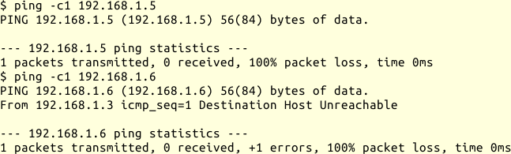

## arp {#sec-netz-werkzeuge-arp}

Das Programm `arp` dient der Anzeige und Manipulation des ARP-Caches des
Kernels.
Ich setze es bei Problemen in direkt angeschlossenen Netzsegmenten ein und
verwende es

*   um die Zuordnung von IP-Adressen zu Ethernet-Adressen zu verifizieren

*   um zu sehen, ob ein Rechner eine IP-Adresse verwendet, auch wenn
    ich keine Antwort auf TCP-, UDP- oder ICMP-Verbindungsversuche (Ping)
    bekomme.

*   seltener: um eine Zuordnung zwischen IP-Adresse und
    Ethernet-Adresse fest vorzugeben.

Der prinzipielle Aufruf ist:

{line-numbers=off,lang="text"}
    # arp [Optionen] [$rechnername]

Bei Aufruf ohne Optionen zeigt `arp` die MAC-Adressen an, die *$rechnername*
zugeordnet sind. Fehlt *$rechnername*, zeigt es alle bekannten
Adresszuordnungen an.
*$rechnername* kann ein Hostname sein, ein FQDN oder eine IP-Adresse.

Die für die Fehlersuche wichtigsten Optionen sind:

-n
: unterlässt die Namensauflösung der IP-Adressen

-d $rechnername
: entfernt alle Einträge für *$rechnername*

-s $rechnername $hardwareadresse
: setzt den Eintrag für *$rechnername* auf *$hardwareadresse*

Für weitergehende Informationen verweise ich auf die Handbuchseite.
Nähere Informationen zum ARP-Protokoll stehen im
[Grundlagenkapitel für Netze](#sec-grundlagen-arp).

Wenn ich `arp` verwende, um mich von der Anwesenheit eines Rechners mit einer
bestimmten IP-Adresse im Netz zu überzeugen, sieht das wie folgt aus:

Ich habe von keiner der beiden Adressen eine
Antwort auf die PING-Anfrage bekommen.
Bei `192.168.1.6` kam jedoch nach kurzer Verzögerung die Meldung
*Destination Host Unreachable*, die bei `192.168.1.5` fehlte.
Bei der Kontrolle des ARP-Caches zeigt sich, dass für die eine IP-Adresse
eine MAC-Zuordnung gegeben ist, für die andere nicht.

{line-numbers=off,lang="text"}
    $ arp -an
    ? (192.168.1.5) auf 00:01:6c:6f:c5:d6 [ether] auf eth0
    ? (192.168.1.6) auf <unvollständig> auf eth0
    ...

Das lässt vermuten, dass auf dem Rechner mit IP-Adresse `192.168.1.5` PING
durch Paketfilterregeln blockiert wird, während in diesem Netzsegment zu
diesem Zeitpunkt kein Gerät die IP-Adresse 192.168.1.6 für sich beanspruchte.

