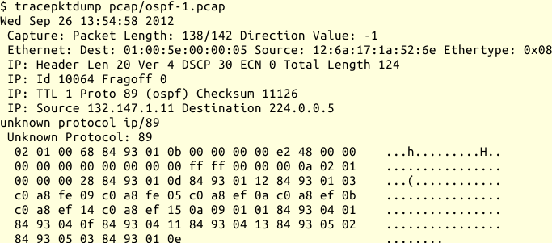

## libtrace und libtrace-tools {#sec-netz-werkzeuge-libtrace}

Mit libtrace kann ich ähnlich wie mit libpcap eigene Analysewerkzeuge
programmieren. Hier will ich aber auf die mitgelieferten libtrace-tools
eingehen, mit denen ich Mitschnitte anfertigen und weiter bearbeiten kann.

Ein Vorteil von libtrace ist, dass diese Bibliothek und die damit
geschriebenen Werkzeuge mit Paketmitschnitten aus unterschiedlichen Quellen
umgehen und die verschiedenen Formate ineinander umwandeln können.
Dazu verwendet libtrace sogenannte URI um das Format und die Quelle
beziehungsweise das Ziel anzugeben.

Die folgende Tabelle listet einige der unterstützten Formate auf und gibt an,
ob libtrace diese schreiben kann.

{title="Unterstützte Formate für Paketmitschnitte"}
| Format                      | URI            | Read | Write |
|-----------------------------|----------------|------|-------|
| Live PCAP Schnittstelle     | pcapint:$int   | Ja   | Ja    |
|-----------------------------|----------------|------|-------|
| PCAP Trace Datei            | pcapfile:$fn   | Ja   | Ja    |
|-----------------------------|----------------|------|-------|
| ERF Trace Datei             | erf:$fn        | Ja   | Ja    |
|-----------------------------|----------------|------|-------|
| DAG Gerät                   | dag:$devloc    | Ja   | Ja    |
|-----------------------------|----------------|------|-------|
| Native Linux interface      | int:$int       | Ja   | Ja    |
|-----------------------------|----------------|------|-------|
| Native Linux interface      | ring:$int      | Ja   | Ja    |
| (ring buffers)              |                |      |       |
|-----------------------------|----------------|------|-------|
| Native BSD interface        | bpf:$int       | Ja   | Nein  |
|-----------------------------|----------------|------|-------|
| TSH trace file              | tsh:$fn        | Ja   | Nein  |
|-----------------------------|----------------|------|-------|
| FR+ trace file              | fr+:$fn        | Ja   | Nein  |
|-----------------------------|----------------|------|-------|
| Legacy DAG ATM Trace Datei  | legacyatm:$fn  | Ja   | Nein  |
|-----------------------------|----------------|------|-------|
| Legacy DAG POS Trace Date   | legacypos:$fn  | Ja   | Nein  |
|-----------------------------|----------------|------|-------|
| Legacy DAG Ethernet Trace   | legacyeth:$fn  | Ja   | Nein  |
| Datei                       |                |      |       |
|-----------------------------|----------------|------|-------|
| Legacy DAG NZIX Trace Datei | legacynzix:$fn | Ja   | Nein  |
|-----------------------------|----------------|------|-------|
| ATM Cell Header Trace Datei | atmhdr:$fn     | Ja   | Nein  |
|-----------------------------|----------------|------|-------|
| RT Network Protocol         | rt:$host:$port | Ja   | Nein  |

Genug der Vorrede, kommen wir zu den Werkzeugen.

### traceanon

Mit `traceanon` kann ich die IP-Adressen von Paketmitschnitten anonymisieren.
Das ist wichtig, wenn ich einen Paketmitschnitt zu einem Problem weiterreichen,
aber möglichst wenig Informationen zur Netzwerkstruktur preisgeben will.

Das Programm `traceanon` ändert die IP-Header der Datenpakete sowie die in ICMP
eingebetteten IP-Header und repariert die Prüfsummen innerhalb von TCP- und
UDP-Headern.

Es gibt zwei Schemata: bei dem einen ersetzt `traceanon` einen kompletten
Adressblock durch einen anderen und beim anderen ersetzt es die Adressen mit dem
Cryptopan-Verfahren einzeln.

Wichtig beim Einsatz von `traceanon` ist, immer im Hinterkopf zu behalten,
dass IP-Adressen auch auf anderem Weg preisgegeben werden können.
So werden IP-Adressen innerhalb von ARP-Paketen nicht anonymisiert und einige
Anwendungsprotokolle wie zum Beispiel HTTP, SMTP, OSPF und andere
Routingprotokolle können in den Anwendungsdaten Informationen über die
beteiligten Netze verraten.

Der Aufruf sieht so aus:

{line-numbers=off,lang="text"}
    $ traceanon [options] $sourceuri $desturi

Die Beschreibung der Optionen steht in der Handbuchseite.

### tracediff

Dieses Werkzeug findet Differenzen zwischen zwei Mitschnitten und gibt diese
aus.
Dabei wertet es den Inhalt der Framingheader (PCAP oder ERF) nicht aus.

Mit der Option `-m $max` kann ich die Ausgabe nach `$max`
Unterschieden abbrechen lassen.

Der Aufruf sieht so aus:

{line-numbers=off,lang="text"}
    $ tracediff [ -m $maxdiff ] $firsturi $seconduri

Tracediff ist nützlich, wenn ich mehrere Mitschnitte einer
Verbindungssitzung an verschiedenen Stellen aufgenommen habe und diese
vergleichen will.

### tracemerge

Mit diesem Werkzeug kann ich zwei oder mehrere Paketmitschnitte zu einem
kombinieren, wobei die Reihenfolge der Pakete beibehalten wird.

Der Aufruf sieht so aus:

{line-numbers=off,lang="text"}
    $ tracemerge [ options ] $outputuri $inputuri ...

Die Optionen sind in der Handbuchseite beschrieben.

### tracepktdump

Mit diesem Programm kann ich Datenpakete in lesbarer Form ausgeben.
Dabei kann ich mit der Option `-f $filter` die Ausgabe auf bestimmte
Pakete einschränken und mit `-c $count` die Anzahl der angezeigten
Pakete begrenzen.

Die Ausgabe ist abhängig davon, inwieweit die Protokolle in
libtrace bekannt sind und ändert sich folglich von Version zu Version.

Folgender Beispielaufruf mit tracepktdump aus den libtrace-tools Version
3.0.10 soll das verdeutlichen:

In dieser Version ist das OSPF-Protokoll in der Bibliothek noch nicht
bekannt und wird als Hexdump präsentiert.
Die IP- und Ethernet-Header hingegen werden dekodiert und erscheinen nicht
im Hexdump.

### tracereplay

Dieses Werkzeug spielt einen Paketmitschnitt mit den gleichen Zeitabständen
aus einer URI zu einer anderen.
Ich kann damit einen Mitschnitt wieder auf das Netz schicken,
wenn die zweite URI ein Netzwerkinterface bestimmt,
Prüfsummen werden während des Abspielens neu berechnet.

Mit der Option `-f $filter` kann ich die zurückgespielten Datenpakete
einschränken.

Beim Zurückspielen verwendet `tracereplay` die Ethernet-Adressen aus
dem Mitschnitt, mit `-b` kann ich als Ziel-Ethernet-Adresse jedoch die
Broadcast-Adresse angeben.

Der Aufruf sieht so aus:

{line-numbers=off,lang="text"}
    $ tracereplay [ options ] $inputuri $outputuri

Die Optionen sind in der Handbuchseite beschrieben.

### tracereport

Dieses Programm kann eine Reihe von Berichten über die Eigenschaften von
Paketmitschnitten produzieren.
Die Berichte landen in Dateien, deren Name
gleich der langen Option gefolgt vom Suffix `.rpt` ist.

Folgende Optionen und Reports sind für mich bei der Fehlersuche interessant:

-e | --error
: erzeugt einen Bericht über Paketfehler (zum Beispiel
  Prüfsummenfehler, Empfangsfehler).

-F | --flow
: erzeugt einen Bericht über die Anzahl von Datenflüssen.

-m | --misc
: liefert einen allgemeinen Bericht (Zeitpunkt des ersten
  und letzten Paketes, Gesamtzahl der Pakete, ...)

-P | --protocol
: erzeugt einen Bericht über die im Mitschnitt
  vorkommenden Protokolle der Transportschicht

-p | --ports
: liefert einen Bericht über die vorkommenden Ports

-t | --ttl
: berichtet über die TTL der Datenpakete im Mitschnitt

-n | --nlp
: berichtet über die im Mitschnitt vorkommenden Protokolle
  der Netzwerkschicht

-d | --direction
: berichtet, wieviel Traffic in jede Richtung geht

Mehr Optionen und Berichte beschreibt die Handbuchseite.

### tracertstats

Mit diesem Programm bekomme ich eine einfache filter- und zeitbasierte
Analyse eines Paketmitschnitts.
Dabei teilt es den Mitschnitt in Intervalle und gibt für jedes Intervall
an, wie viele Datenpakete passend zu den angegebenen Filtern vorkommen.

Die möglichen Optionen sind unter anderen:

-f $filter
: legt die Filter für die Analyse fest, diese Option kann ich mehrfach angeben

-i $interval
: bestimmt das zugrunde liegende Zeitraster in Sekunden

-m
: wenn ich mehrere Paketmitschnitte angebe, sollen diese
  zusammengefasst werden (merge)

-o $format
: legt das Ausgabeformat fest (`txt`, `csv`, `html`)

Weitere Optionen stehen in der Handbuchseite.
  
### tracestats

Dieses Programm gibt ähnliche Analysen wie tracertstats aus, aber jeweils
für den gesamten Paketmitschnitt und nicht für einzelne Zeitintervalle
daraus. Mit der Option `-f $filter` kann ich auch hier die Pakete
angeben, an denen ich interessiert bin.

Das Programm `tracesummary`
gibt eine einfache Zusammenfassung für einen Paketmitschnitt an
und ist ein Shellwrapper um `tracestats`.

### tracesplit

Dieses Programm teilt einen Paketmitschnitt in mehrere Dateien auf.

Das kann ich unter anderen mit diesen Optionen beeinflussen:

-f $filter
: gibt nur die Pakete aus, die zu dem angegebenen Filter passen

-c $count
: schreibt maximal `$count` Pakete pro Ausgabedatei.
  Die Ausgabedateien werden nach dem in der Output-URI angegebenen Basisnamen
  benannt, an den die Nummer des ersten Paketes in der Datei angehängt
  wird.

-b $bytes
: schreibt maximal `$bytes` Bytes in eine Datei

-i $seconds
: startet eine neue Datei aller `$seconds` Sekunden

-s $unixtime
: beginnt die Ausgabe bei `$unixtime`

-e $unixtime
: endet die Ausgabe bei `$unixtime`

-m $max
: erzeugt nicht mehr als `$max` Ausgabedateien

-S $snaplen
: schneidet die Datenpakete bei `$snaplen` ab. Ohne
  diese Angabe wird das komplette Datenpaket geschrieben.

-z $level
: setzt den Kompressionsgrad (0..9)

-Z $method
: wählt die Kompressionsmethode (`gzip`, `bzip2`, `lzo` oder `none`)

Weitere Optionen stehen in der Handbuchseite.

Zwei weitere Werkzeuge sind lediglich Shellwrapper um das Programm
`tracesplit`:

traceconvert
: transformiert einen Mitschnitt aus einem Format in ein anderes

tracefilter
: extrahiert Datenpakete anhand von BPF-Filtern aus einem Mitschnitt

### tracetop

Das Programm zeigt die aktivsten n Datenflüsse in einem Intervall an, ähnlich
wie `top` für Prozesse oder `mytop` für MySQL-Verbindungen.

Ich kann die Ausgabe mit folgenden Optionen an meine Bedürfnisse anpassen:

-f $filter
: zählt nur die Pakete, die zu dem Filter passen

-i $interval
: gibt das Intervall in Sekunden zwischen den
  Bildschirmaktualisierungen vor (Voreinstellung 2 Sekunden)

--percent
: zeigt die Bytes und Pakete der Datenflüsse als Anteil vom Gesamtdatenverkehr

--bits-per-second
: zeigt die Datenübertragungsrate als Bits pro Sekunde an

