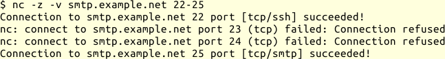

## Netcat {#sec-netz-werkzeuge-netcat}

Ein weiteres Werkzeug um schnell eine Netzwerkverbindung herzustellen,
ähnlich wie `telnet` doch weitaus flexibler, ist `netcat`.
Damit kann ich nicht nur TCP-, UDP- oder UNIX-Socket-Verbindungen einfach
aufbauen, sondern auch schnell einen Socket-Server für die genannten
Protokolle einrichten.

Netcat ist sehr gut in Skripten einsetzbar und kann auch ein rudimentäres
Port-Scanning für TCP-Ports.
Außerdem, was in manchen Umgebungen wichtig sein kann: `netcat` kann mit
Proxy-Servern umgehen und darüber Verbindungen herstellen.

### Aufruf

Der grundlegende Aufruf ist

{line-numbers=off,lang="text"}
    $ netcat [ optionen ] $host $port

wenn ich eine Verbindung via TCP oder UDP aufbauen will,

{line-numbers=off,lang="text"}
    $ netcat [ optionen ] $port

wenn ich auf TCP- oder UDP-Verbindungen warten will, und

{line-numbers=off,lang="text"}
    $ netcat [ optionen ] $socketpath

wenn ich mit UNIX-Domain-Sockets arbeiten will.

Will ich einen Portscan mit Option `-z` starten, kann ich statt
eines Ports auch einen Bereich (`$port1-$port2`) angeben.

### Optionen

Einige der wichtigsten Optionen sind:

-k
: In Verbindung mit der Option `-l` wartet `netcat` auf weitere
  Verbindungen, nachdem die erste endet.
  Ohne diese Option beendet sich `netcat` nach der ersten Verbindung.

-l
: Damit wartet `netcat` auf eine ankommende Verbindung anstatt selbst eine
  Verbindung zu öffnen.

-s $addr
: Setzt die Absenderadresse auf `$addr`.
  Das ist nützlich, wenn der Rechner mehrere Adressen hat und einige davon
  vielleicht durch Paketfilter gesperrt sind.

-U
: verwendet UNIX-Domain-Sockets

-u
: verwendet UDP statt TCP

-X $proto
: verwendet Proxy-Protokoll `$proto`. Mögliche Werte sind
  `4` für SOCKS Version 4, `5` für SOCKS Version 5 und
  `connect` für die CONNECT-Methode bei HTTP-Proxies.

-x $addr:$port
: spezifiziert die Adresse und den Port des Proxyservers.

-z
: weist `netcat` an, keine Verbindung aufzubauen, sondern nur
  nachzuschauen, ob der Port oder Portbereich offen ist.
  Diese Option kombiniere ich sinnvollerweise mit `-v`.

Weitere Optionen finden sich in den Handbuchseiten.

### Beispiele

Die folgenden Beispiele sind der Handbuchseite von `netcat` entnommen.

#### Client/Server

Für eine einfache Client-Server-Verbindung gebe ich folgendes auf der
Serverseite ein:

{line-numbers=off,lang="text"}
    $ netcat -l 1234

Auf der Clientseite dann das folgende:

{line-numbers=off,lang="text"}
    $ netcat host.example.net 1234

um mich mit dem Server zu verbinden.

Mit Option `-u` verwende ich UDP statt TCP zur Übertragung.

Mit Option `-U` geht es stattdessen über UNIX-Domain-Sockets.
Dann verwende ich statt der Portnummer den Pfadnamen zur Socketdatei und
lasse auf Clientseite den Rechnernamen weg.
Die Socketdatei darf beim Start des Serverprozesses noch nicht existieren.

#### Datentransfer

Um schnell mal eine Datei zu übertragen, erweitere ich das Client/Server
Beispiel auf Serverseite wie folgt:

{line-numbers=off,lang="text"}
    $ netcat -l 1234 > file.out

Und auf Clientseite:

{line-numbers=off,lang="text"}
    $ netcat host.example.net 1234 < file.in

Die Verbindung wird nach erfolgter Datenübertragung automatisch geschlossen.
Vertausche ich die spitzen Klammern, wird die Datei vom Server zum Client
übertragen.

#### Einen Server testen

Wenn ich das Plaintext-Protokoll des Servers kenne, kann ich mit `netcat` auch
komplexe Protokolle bedienen oder testen:

{line-numbers=off,lang="text"}
    $ netcat -C mail.example.net 25 <<EOT
    HELO host.example.net
    MAIL FROM:<user@host.example.net>
    RCPT TO:<user2@host.example.net>
    DATA
    Subject: Testmail
    
    Body of email.
    .
    QUIT
    EOT

Mit diesem kurzen Skript kann ich eine E-Mail einspeisen, um einen
Mailserver zu testen.
Das gleiche kann ich auch interaktiv von Hand eingeben.
Oder ich kann auf einem einem POP3-Server nachsehen,
ob die E-Mail angekommen ist.

#### Portscanning

Um festzustellen, welche Ports an einem Rechner erreichbar sind, kann ich
`netcat` mit den Optionen `-z` und `-v` aufrufen:

