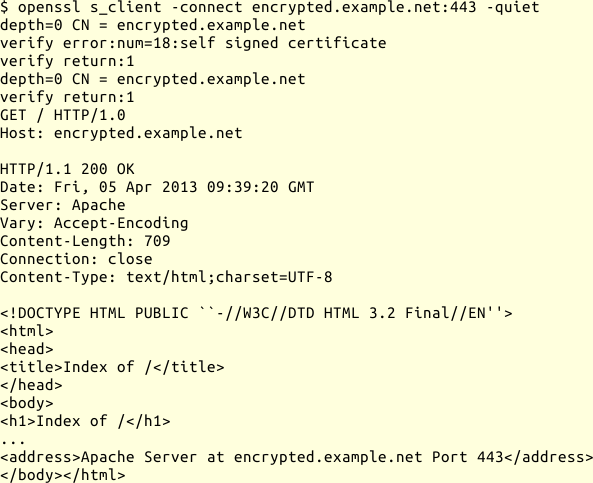

## OpenSSL s_client {#sec-netz-werkzeuge-openssl}

OpenSSLs `s_client` ist das dritte Werkzeug, welches ich zu Verbindungstests
verwende.
Dabei handelt es sich um einen generischen SSL/TLS Client, mit dem ich
verschlüsselte Protokolle wie HTTPS oder SSMTP und die
entsprechenden Server testen kann.

### Aufruf

Der grundlegende Aufruf sieht wie folgt aus:

{line-numbers=off,lang="text"}
    $ openssl s_client -connect $host:$port [ options ]
  
### Optionen

Die folgenden Optionen verwende ich häufiger, weitere sind, wie fast immer,
in den Handbuchseiten zu finden.

-connect $host:$port
: Baut eine SSL- oder TLS-Verbindung zu dem angegebenen Server und Port auf.

-crlf
: Setzt den Zeilenvorschub des Terminals in CR+LF, wie für
  einige Protokolle gefordert, um.

-quiet
: Unterdrückt die Ausgabe der Zertifikat-Informationen.

-starttls $proto
: sendet die protokollspezifischen Befehle um eine
  Verbindung auf TLS umzuschalten.
  Momentan werden die folgenden Protokolle unterstützt:
  `smtp`, `pop3`, `imap`, `ftp`.

Bei Problemen mit der Aushandlung des SSL-Protokolls kann ich mit den
Optionen `-bugs`, `-ssl2`, `-ssl3`, `-tls`, `-no_ssl2`, ... experimentieren.
Details finden sich in der Handbuchseite.

### HTTPS-Anfrage

Das folgende Beispiel zeigt eine HTTPS-Anfrage mit openssl:

Nachdem `verify return:1` mir anzeigt, dass die verschlüsselte Verbindung
steht, gebe ich meine Anfrage an den Webserver genau so ein, wie ich es mit
`netcat` bei einem unverschlüsselten Server tun würde und bekomme die Antwort
des Servers angezeigt.

### SMTP-SASL-Test

Um die Authentisierung bei SMTP mit SASL zu testen, muss ich mir zunächst den
String für die Credentials berechnen.
Das PLAIN-SASL-Verfahren ist in RFC4616 beschrieben.
Bei diesem sendet der Client einen String mit folgendem Aufbau an den Server.

{line-numbers=off,lang="text"}
    authzid \0 authcid \0 passwd

Dabei ist

authzid
: die Authorization Id, die Identität, deren Rechte ich nutzen möchte.

authcid
: die Authentication Id, die Identität, als die ich mich anmelde.

passwd
: das Passwort

Der Server überprüft die Gültigkeit von *authcid* und *passwd* und dann, ob
der Client damit die Rechte der *authzid* ausüben darf.

Da SMTP ein Plaintext-Protokoll ist, wird der String vor dem Senden mit Base64
codiert.
Mit Hilfe von Perl kann ich mir diesen String berechnen lassen:

{line-numbers=off,lang="text"}
    $ perl -MMIME::Base64 \
      -e 'print encode_base64("john\0john\0passwd")';
    am9obgBqb2huAHBhc3N3ZA==

Dann baue ich eine verschlüsselte Verbindung mit STARTTLS zum
Mailserver auf und melde mich an:

{line-numbers=off,lang="text"}
    $ openssl s_client -connect smtp.example.net:25\
      -starttls smtp -quiet
    depth=0 CN = smtp.example.net
    verify error:num=18:self signed certificate
    verify return:1
    depth=0 CN = smtp.example.net
    verify return:1
    250 DSN
    EHLO client.example.net
    250-smtp.example.net
    250-PIPELINING
    250-SIZE 10240000
    250-VRFY
    250-ETRN
    250-AUTH PLAIN LOGIN
    250-ENHANCEDSTATUSCODES
    250-8BITMIME
    250 DSN
    AUTH PLAIN am9obgBqb2huAHBhc3N3ZA==
    235 2.7.0 Authentication successful
    QUIT
    221 2.0.0 Bye

Die Meldung `235 2.7.0 Authentication successful` zeigt mir, dass die
Anmeldung erfolgreich war.
